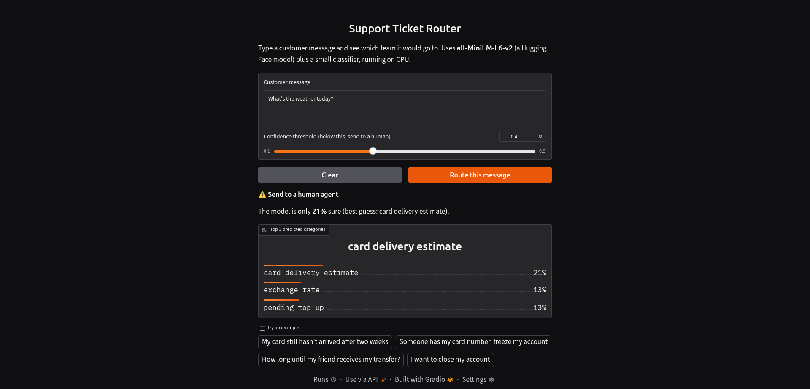

# cpu-only-llm-benchmark

A benchmark of open-source language models (Hugging Face and Ollama) on a CPU-only laptop, built around one business decision.

## Problem
A small company receives thousands of customer support messages and wants to route each one to the right team automatically. It has no GPU servers. Which open-source model should it deploy?

## Aim
Compare small open models on the same task, using the same data, and measure:
- Accuracy (F1 score)
- Speed (latency per message)
- Memory use (RAM)
- Estimated cost per 100,000 messages

## Approach
1. Use the public `PolyAI/banking77` dataset (customer banking queries labeled by intent).
2. Run Hugging Face models (small encoders and zero-shot models) and Ollama LLMs (`qwen2.5:3b`, `qwen2.5:7b-instruct`) on a fixed test sample.
3. Analyze where each model fails, not just how often.
4. Write a decision memo recommending one model.

## Gain
- A clear, evidence-based answer to "which model should we deploy on CPU?"
- Hands-on practice with the Hugging Face Hub, `transformers`, `datasets`, Ollama, and model evaluation.
- A reproducible project with one git commit per task.

## Tech stack
Python 3.12, PyTorch (CPU), Hugging Face `transformers` and `datasets`, Ollama, scikit-learn, pandas.

## Project structure
- `data/` datasets (not committed)
- `notebooks/` exploration
- `src/` benchmark scripts
- `results/` metrics and charts
- `reports/` final decision memo
- `app/` demo app

## Status
Work in progress. See `ACTIVITY_LOG.md` for every step taken and why.
