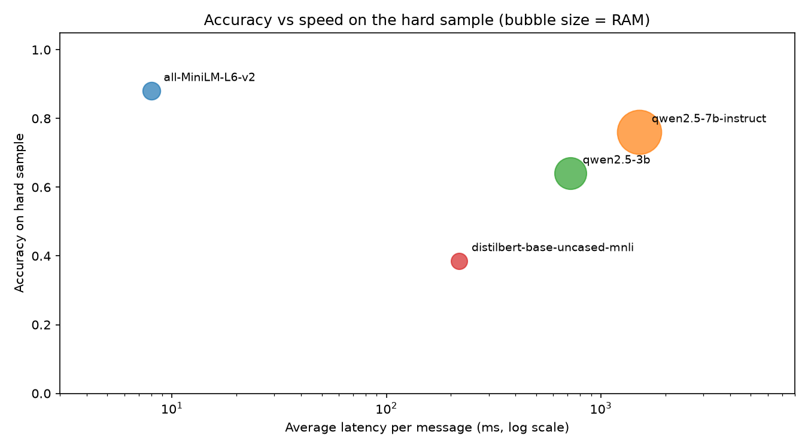
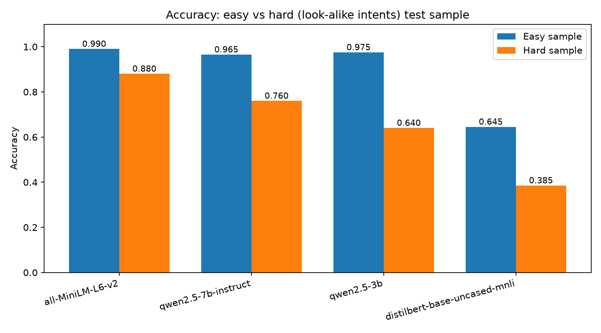

# cpu-only-llm-benchmark

Which open-source model should a small company deploy on CPU-only servers to route customer support tickets? A benchmark of four models, a decision memo, and a live demo, built and run entirely on a 16 GB laptop with no GPU.



## Problem

A company receives thousands of customer messages and needs each one routed to the right team. It has no GPU servers.

## Aim

Compare open-source models on the same task and measure what a business actually cares about: accuracy, speed, memory, and whether the model needs labeled training data.

## Results

Tested on two 200-message samples from the [banking77](https://huggingface.co/datasets/mteb/banking77) dataset: an **easy** sample (10 clearly different intents) and a **hard** sample (10 look-alike intents in 5 confusable pairs).

| Model | Easy accuracy | Hard accuracy | Hard latency | Hard RAM |
|---|---|---|---|---|
| **all-MiniLM-L6-v2 + logistic regression** | 0.990 | **0.880** | 8.0 ms | 638 MB |
| qwen2.5-7b-instruct (Ollama) | 0.965 | 0.760 | 1,509.7 ms | 4,854 MB |
| qwen2.5-3b (Ollama) | 0.975 | 0.640 | 719.8 ms | 2,438 MB |
| distilbert-base-uncased-mnli (zero-shot) | 0.645 | 0.385 | 218.4 ms | 513 MB |



**Finding:** an easy test hides real differences. On clearly different categories, three models score 96-99%. On look-alike categories the small embedding model stays strong (88%) while the LLMs drop sharply, and the zero-shot model collapses.

Full write-up: [`reports/decision_memo.md`](reports/decision_memo.md). Failure analysis: [`results/all_errors.csv`](results/all_errors.csv), generated by `src/failure_analysis.py`.

## Recommendation

Deploy **all-MiniLM-L6-v2 with a logistic-regression classifier** if labeled tickets exist (about 1,300 examples were enough here): most accurate, about 190x faster than the best LLM, about 1/8 the memory. If no labeled data exists yet, use **qwen2.5:7b-instruct** via Ollama as a stop-gap while collecting labels. Full reasoning and risks in the memo.

## Demo

A Gradio app that routes a typed message and sends low-confidence messages to a human instead of guessing.


```bash
python app/app.py
```

## Project structure

```
data/          datasets (not committed; scripts recreate them)
notebooks/     exploration
src/           benchmark and analysis scripts
results/       metrics, predictions, charts
reports/       decision memo
app/           Gradio demo
docs/          glossary, interview Q&A, presentation guide
```

## Reproduce it

```bash
git clone https://github.com/Shimu-I/cpu-only-llm-benchmark.git
cd cpu-only-llm-benchmark
python3 -m venv .venv
source .venv/bin/activate
pip install -r requirements.txt

# install Ollama separately (https://ollama.com) and pull the models used here:
ollama pull qwen2.5:3b
ollama pull qwen2.5:7b-instruct

python src/prepare_data.py
python src/prepare_hard_data.py

python src/benchmark_hf_zeroshot.py
python src/benchmark_embeddings.py
python src/benchmark_ollama.py qwen2.5:3b
python src/benchmark_ollama.py qwen2.5:7b-instruct

# repeat the four benchmark lines above with "hard" appended for the hard sample
python src/make_comparison.py
python src/failure_analysis.py
```

Every command, in order, with an explanation of what it does and why, is in [`ACTIVITY_LOG.md`](ACTIVITY_LOG.md).

## What I learned

- An easy benchmark can hide the real differences between models; a harder, deliberately confusable test was needed to separate them.
- A small, frozen embedding model with a simple classifier can beat much larger LLMs on a well-defined classification task, if labeled data exists.
- Model confidence isn't automatically trustworthy, and a confidence threshold with human fallback is a practical safeguard.
- Working entirely on CPU meant caring about latency and memory from the start, not as an afterthought.

## Limitations

- 200 messages per test sample; small differences between models may be noise.
- One dataset (banking77); real tickets may be messier or multilingual.
- LLMs were tested zero-shot (category names only), while the classifier used ~1,300 labeled examples — not a fully fair comparison.
- Speed measured single-message, single-laptop; batching would change the numbers.

## More

- [`docs/glossary.md`](docs/glossary.md): every technical term used here, in plain English.
- [`docs/interview_qa.md`](docs/interview_qa.md): 66 questions and answers about this project.
- [`docs/project_story.md`](docs/project_story.md): how to present it.

## Tech stack

Python 3.12, PyTorch (CPU), Hugging Face `transformers` and `datasets`, Ollama, scikit-learn, pandas, matplotlib, Gradio.